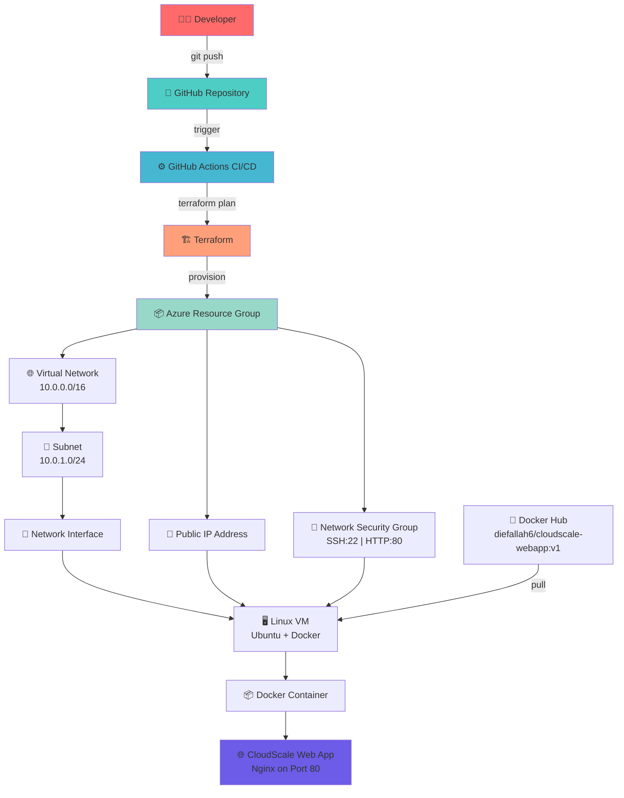
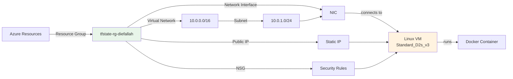
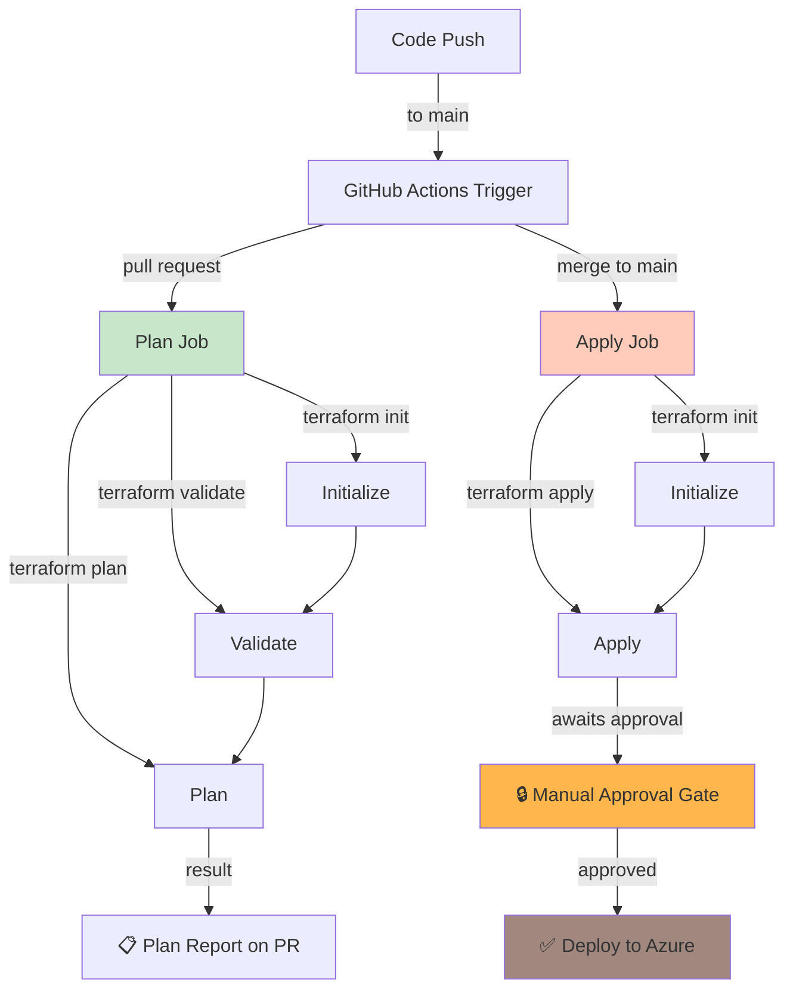
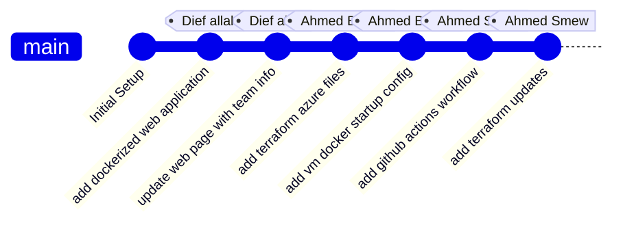

# ☁️ CloudScale Infrastructure as Code Project

> **Infrastructure as Code with Terraform and Azure** — A cloud-native deployment automation solution

---

## 📋 Project Information

| Attribute | Details |
|-----------|---------|
| **Title** | Infrastructure as Code with Terraform and Azure |
| **Course** | Cloud Computing & DevOps Engineering |
| **Scenario** | Deploy a containerized web application to Azure using Docker, Terraform, and GitHub Actions CI/CD |
| **Repository** | [Diefallah6/Second-Project](https://github.com/Diefallah6/Second-Project) |

---

## 👥 Team Members

| Name | Student ID |
|------|-----------|
| Dief allah Ateeyah | 4808 |
| Ahmed Ben Ali | 4772 |
| Ahmed Smew | 4743 |

---

## 🎯 Project Overview

This project demonstrates a **complete Infrastructure as Code (IaC) solution** that deploys a containerized web application to Microsoft Azure. The architecture combines:

- **Docker** for containerization
- **Terraform** for infrastructure provisioning
- **GitHub Actions** for CI/CD automation
- **Azure** for cloud resources

---

## 🏗️ Architecture Diagram



---

## 🛠️ Technologies & Stack

| Category | Technology |
|----------|-----------|
| **Containerization** | Docker, Docker Hub |
| **Infrastructure** | Terraform, Microsoft Azure |
| **CI/CD** | GitHub Actions |
| **Compute** | Linux VM (Ubuntu), Nginx |
| **Networking** | Virtual Network, Subnet, NSG, Public IP |
| **Frontend** | HTML/CSS |

---

## 🐳 Docker Configuration

### Docker Image Details

```
Repository: diefallah6
Image Name: diefallah6/cloudscale-webapp:v1
Exposed Port: 80
Web Server: Nginx (Alpine)
```

### Dockerfile

```dockerfile
FROM nginx:alpine
COPY app/index.html /usr/share/nginx/html/index.html
EXPOSE 80
```

### Build & Push Instructions

```bash
# Build the Docker image
docker build -t diefallah6/cloudscale-webapp:v1 .

# Login to Docker Hub
docker login

# Push the image
docker push diefallah6/cloudscale-webapp:v1
```

---

## 🏛️ Terraform Infrastructure

### Azure Resources Provisioned



### Resource Configuration Table

| Resource | Configuration | Details |
|----------|---------------|---------|
| **Resource Group** | `tfstate-rg-diefallah` | Primary container for all resources |
| **Virtual Network** | `10.0.0.0/16` | Network address space |
| **Subnet** | `10.0.1.0/24` | Subnet prefix |
| **VM Size** | `Standard_D2s_v3` | *Changed from Standard_B1s due to capacity constraints* |
| **Region** | `switzerlandnorth` | Deployment region |
| **OS** | Ubuntu Linux | OS Disk attached |
| **Public IP** | Static | For external access |

### Important Configuration Notes

> ⚠️ **VM Size Note:** The handout specified `Standard_B1s`, but Azure capacity restrictions in the selected region required changing to `Standard_D2s_v3`.

> ℹ️ **Provider Configuration:** `resource_provider_registrations = "none"` is used to prevent automatic registration errors.

---

## ⚡ Terraform Setup & Deployment

### Initialize Terraform

```bash
cd terraform

# Initialize Terraform
terraform init

# Validate configuration
terraform validate
```

### Plan Infrastructure

```bash
terraform plan -input=false -var="admin_password=CloudScale@2026Pass"
```

### Deploy Infrastructure

```bash
terraform apply -auto-approve -input=false -var="admin_password=CloudScale@2026Pass"
```

### Terraform File Structure

```
terraform/
├── providers.tf      # Azure provider configuration
├── variables.tf      # Input variables
├── main.tf          # Resource definitions
└── outputs.tf       # Output values
```

---

## 🐋 VM Docker Startup Script

The Azure VM executes an automatic startup script that:

1. ✅ Updates Ubuntu package manager
2. ✅ Installs Docker runtime
3. ✅ Enables Docker auto-start
4. ✅ Pulls Docker image from Docker Hub
5. ✅ Runs container with auto-restart policy

### Docker Run Command

```bash
docker run -d \
  --name cloudscale-webapp \
  --restart always \
  -p 80:80 \
  diefallah6/cloudscale-webapp:v1
```

---

## 🚀 GitHub Actions CI/CD Pipeline

### Workflow Architecture



### Workflow File Location

```
.github/workflows/terraform.yml
```

### Workflow Jobs

| Job | Trigger | Actions |
|-----|---------|---------|
| **Terraform Plan** | Pull Request to main | `terraform init` → `validate` → `plan` |
| **Terraform Apply** | Merge to main | `terraform init` → `apply` (with approval) |

### GitHub Secrets Configuration

| Secret Name | Purpose | Location |
|------------|---------|----------|
| `AZURE_CREDENTIALS` | Azure authentication | Settings → Secrets → Actions |
| `TF_ADMIN_PASSWORD` | VM admin password | Settings → Secrets → Actions |

### Manual Approval Gate

The production environment requires manual approval before deployment:

```yaml
environment:
  name: production
  reviewers:
    - required-reviewer
```

---

## 📝 Step-by-Step Implementation Guide

### 1️⃣ Clone Repository
```bash
git clone https://github.com/Diefallah6/Second-Project.git
cd Second-Project
```

### 2️⃣ Create Web Application
```
app/index.html  # Simple HTML page with team info
```

### 3️⃣ Containerize Application
```bash
docker build -t diefallah6/cloudscale-webapp:v1 .
docker push diefallah6/cloudscale-webapp:v1
```

### 4️⃣ Create Terraform Infrastructure
```bash
cd terraform
terraform init
terraform validate
terraform plan -var="admin_password=CloudScale@2026Pass"
```

### 5️⃣ Deploy with Terraform
```bash
terraform apply -auto-approve -var="admin_password=CloudScale@2026Pass"
```

### 6️⃣ Configure GitHub Secrets
- Navigate to: **Settings → Secrets and variables → Actions**
- Add `AZURE_CREDENTIALS` and `TF_ADMIN_PASSWORD`

### 7️⃣ Create GitHub Environment
- Create `production` environment
- Enable required reviewers for manual approval

### 8️⃣ Access Application
```
http://<public-ip-address>
```

---

## 📦 Azure Backend Setup

Terraform state management:

```bash
# Create resource group
az group create \
  --name tfstate-rg-diefallah \
  --location switzerlandnorth

# Create storage account
az storage account create \
  --name tfstate4808diefallah \
  --resource-group tfstate-rg-diefallah \
  --location switzerlandnorth \
  --sku Standard_LRS

# Create storage container
az storage container create \
  --name tfstate \
  --account-name tfstate4808diefallah \
  --auth-mode login
```

---

## 📸 Project Documentation

### Screenshots

| Screenshot | Description |
|-----------|-------------|
| `01-docker-build.png` | ✅ Docker image build successful |
| `02-docker-push.png` | ✅ Docker image pushed to Docker Hub |
| `03-terraform-plan.png` | 📋 Terraform plan output |
| `04-terraform-apply.png` | ✅ Terraform apply output |
| `05-github-actions-plan-pr.png` | 🔍 GitHub Actions plan on PR |
| `06-github-actions-approved-apply.png` | ✅ GitHub Actions approved apply |
| `07-web-app-browser.png` | 🌐 Containerized web app in browser |
| `08-azure-resources.png` | 📊 Azure Portal resource group view |

---

## 👨‍💼 Git Contribution Summary



| Commit | Contributor |
|--------|------------|
| Add dockerized web application | Dief allah Ateeyah |
| Update web page with team information | Dief allah Ateeyah |
| Add Terraform Azure infrastructure files | Ahmed Ben Ali |
| Add VM Docker startup configuration | Ahmed Ben Ali |
| Add GitHub Actions Terraform workflow | Ahmed Smew |
| Add final Terraform updates for GitHub Actions | Ahmed Smew |

---

## ✅ Final Result

A **fully automated, cloud-native deployment pipeline** featuring:

- ✨ **Containerized Application** — Dockerized web app ready for production
- 🔧 **Infrastructure as Code** — Complete Azure infrastructure defined in Terraform
- 🤖 **CI/CD Automation** — GitHub Actions handles planning and deployment
- 🔐 **Security** — Manual approval gates, GitHub secrets, NSG rules
- 📊 **Monitoring Ready** — Scalable infrastructure on Azure
- 🌐 **Public Access** — Application accessible via static public IP

### Access the Application

```
🌍 Application URL: http://<public-ip-address>
```

---

## 📚 Resources

- [Terraform Azure Provider Documentation](https://registry.terraform.io/providers/hashicorp/azurerm/latest/docs)
- [GitHub Actions Documentation](https://docs.github.com/en/actions)
- [Docker Documentation](https://docs.docker.com/)
- [Azure Documentation](https://docs.microsoft.com/en-us/azure/)

---

<div align="center">

**Made with ❤️ by CloudScale Team**

[](https://github.com/Diefallah6/Second-Project)

</div>
